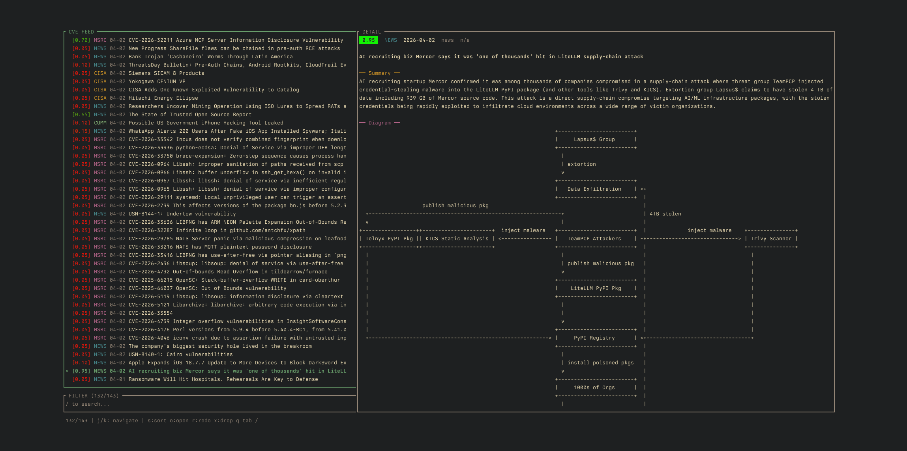

# argusterm

<p align="center">
  
  
</p>

Polls 16 RSS/Atom feeds, scrapes full article content, triages entries via LLM for AI-security relevance, generates ASCII attack-surface diagrams, and renders everything in a ratatui TUI with persistent SQLite caching.

## Architecture

```
RSS/Atom Feeds (16)
  → reqwest async polling
    → feed-rs parsing + HTML stripping + dedup + date filter
      → Parallel.ai page scraping (full article text)
        → Anthropic LLM triage (structured JSON, semaphore-gated)
          → content classification + relevance scoring + CVE extraction
            → Graphviz DOT → graph-easy ASCII diagrams
              → SQLite cache → ratatui TUI
```

## How Scoring Works

Each entry is scored 0.0–1.0 on how much it relates to **AI changing security**:

| Score Range | Meaning | Examples |
|---|---|---|
| **0.7–1.0** | Core AI-security | LLMs finding zero-days, AI-powered vuln research, attacks on ML systems, AI security tooling |
| **0.3–0.7** | Tangential | Traditional vulns in AI-adjacent software, AI policy/regulation |
| **0.0–0.3** | No AI connection | Standard CVEs, generic security news |

The LLM also classifies each entry as `cve`, `advisory`, `news`, `research`, `promotional`, or `irrelevant`. Entries classified as `promotional` or `irrelevant` are automatically hidden.

## Prerequisites

- **Rust** (edition 2024)
- **[Graph::Easy](https://metacpan.org/pod/Graph::Easy)** (Perl) — converts Graphviz DOT to ASCII diagrams
- **Anthropic API key** — for LLM triage
- **Parallel.ai API key** (optional) — for full-page scraping

### Install Graph::Easy

```bash
# via cpanm
cpanm Graph::Easy

# or via cpan
cpan Graph::Easy
```

## Build & Run

```bash
cargo install --path .
argus            # launch TUI
argus --nuke-db  # wipe SQLite cache and start fresh
argus --help     # show usage
```

## Configuration

```bash
cp config/argusterm.eg.toml config/argusterm.toml
```

Edit `config/argusterm.toml`:

```toml
[feeds]
poll_interval_secs = 300       # feed poll interval (seconds)

[llm]
model = "claude-sonnet-4-6"    # Anthropic model for triage
api_key = "your-anthropic-api-key"
max_concurrent = 20            # concurrent LLM requests

[scraper]
api_key = "your-parallel-ai-key"  # optional, for full-page scraping

[diagram]
graph_easy_bin = "/usr/local/bin/graph-easy"  # path to graph-easy binary
perl5lib = "/usr/local/lib/perl5"             # Perl5 lib path for Graph::Easy

[filters]
days_lookback = 7              # only show entries from the last N days

[tui]
refresh_rate_ms = 250          # TUI redraw interval (milliseconds)
```

The `days_lookback` setting controls both which cached entries are loaded on startup and which new feed entries are ingested. The DB retains all entries permanently — widening the window instantly surfaces older cached data.

## Keybindings

| Context | Keys |
|---|---|
| **Feed List** | `j`/`k` nav · `d`/`u` half-page · `gg`/`G` top/bottom |
| **Detail** | `j`/`k` vscroll · `h`/`l` hscroll · `c` enter CVE bar |
| **CVE Bar** | `h`/`l` nav · `o` open on NVD · `Esc` exit |
| **Filter Bar** | type to filter · `Backspace` delete · `Esc`/`Enter` exit |
| **Global** | `o` open URL · `r` re-triage · `x` delete · `s` cycle sort · `/` filter · `Tab` cycle panes · `q`/`Esc` quit |

## Data Persistence

Entries and LLM results are cached in `.argusterm/cache.db` (SQLite). On restart, cached entries within `days_lookback` load instantly; only entries missing LLM results are re-triaged.

